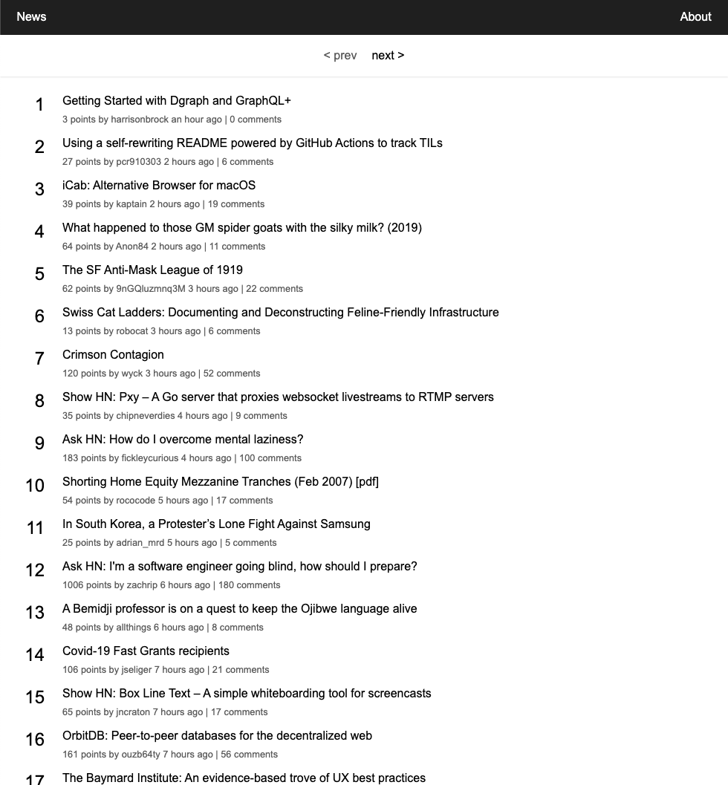

# Test Description

Create a news app using the libraries/frameworks that you are most comfortable with. A fake hacker-news api is provided. The api server is a node server and can be run locally. Please make sure you have `node >=10.x` installed before the test and also make sure you have internet access. The news app will be showing a list of news with pagination. You can put your code inside the given hacker-news folder or start a new project completely. You are allowed to install any dependencies you want. If you find any issues or uncertainty during the test, please feel free to go ahead with your decision and explain why you made this decision.

Estimated time to complete: **3 hours**

**Screenshot**:



**Requirements**:

- use `ES6`
- header and pagination bar should be fixed on the top
- the list on every page must be sorted by `time` in descending order, if `time` are the equal, then sort by `comments_count` in descending order
- `prev` button of the pagination should be disabled when the current page is 1

**Nice to have**:

- use modern frameworks/libraries, e.g. `React` or `Vue` (not limited to these two)
- use a state management library, e.g. `Redux` or `vuex` (not limited to these two). It's probably overkill for this test but would be nice if you can show your understanding of this kind of library.
- some error handling either shown on the page or logged to browser console
- create a theme, i.e. a place to define your core styles so that the app can switch to another set of styles easily later. Don't worry too much about what's in the theme, but it would be nice to show how you would implement the app with a theme. You don't need to provide multiple themes, only one theme which is used in the app is enough.
- implement an `About` page, that is dynamically loaded (loaded on demand when `About` is clicked) instead of loading it with the main page. Don't worry about the content of the `About` page, you can simply put `This is the about page!`.

**Do not need**

- localization
- do not need to worry about the total number of pages

## Getting Started

### Install Dependencies

```
npm run install:server
```

this will install the dependencies for the server.

### API Server

```
npm run server
```

this will start the api server on port `1337`. You can change the port in `server/.env`.

To access the api, go to `localhost:1337` with the following url:

- `GET /news?page=1`
  Returns 30 news items each page.
